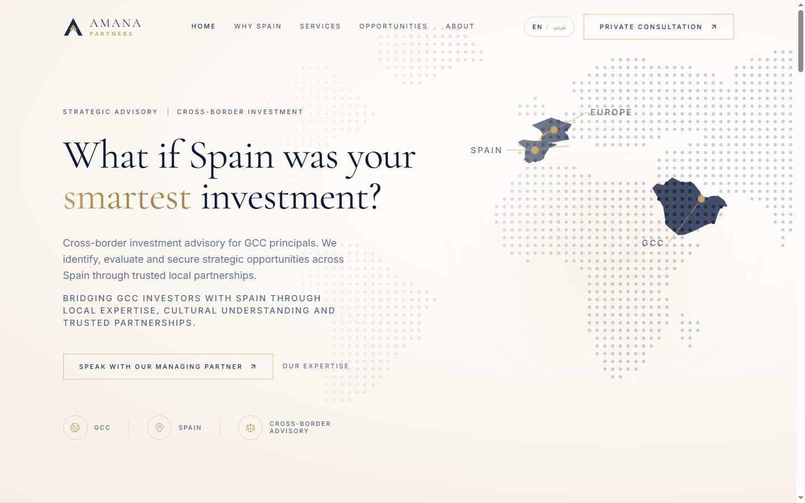
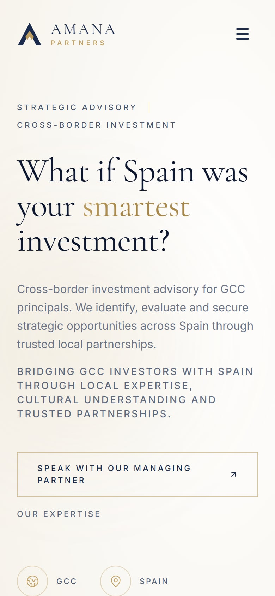
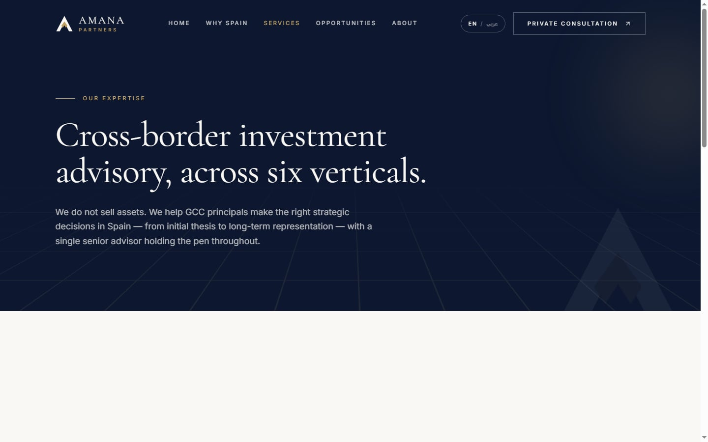
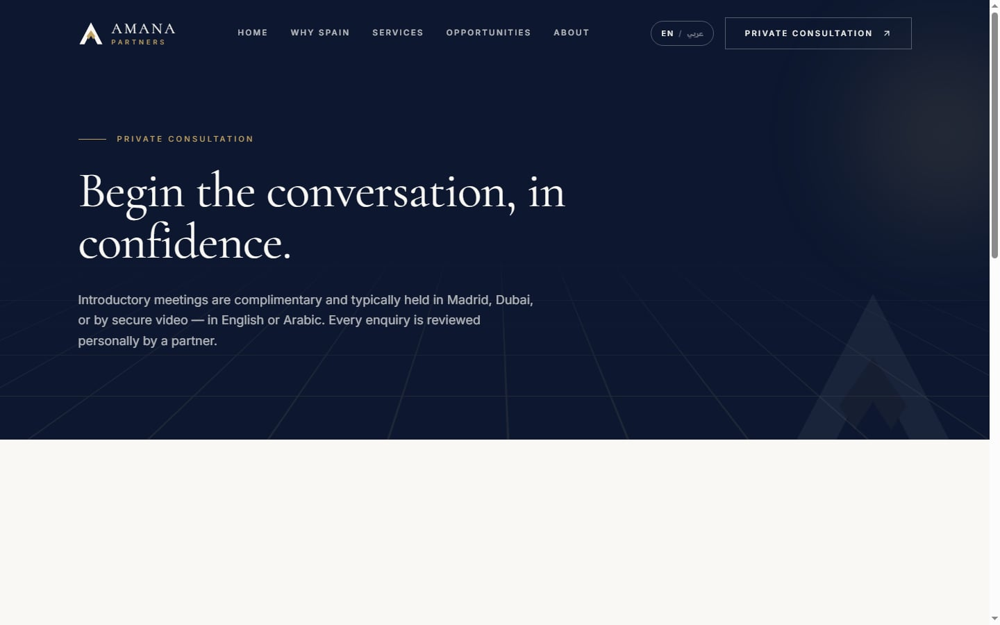
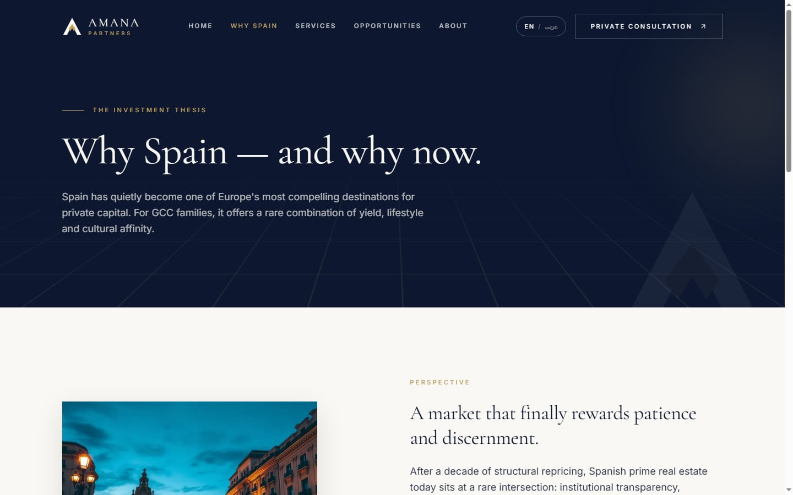
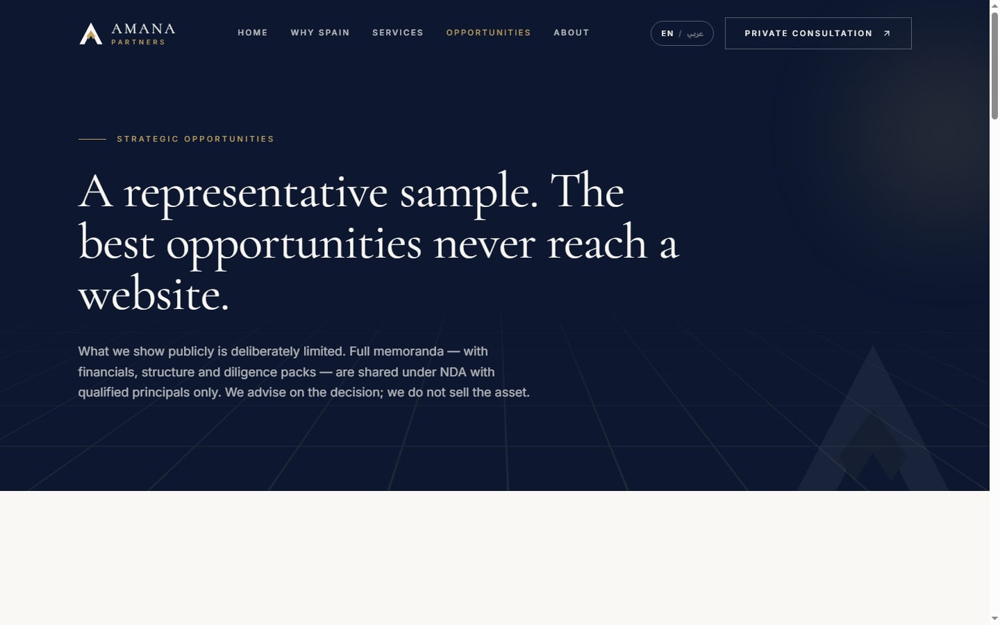
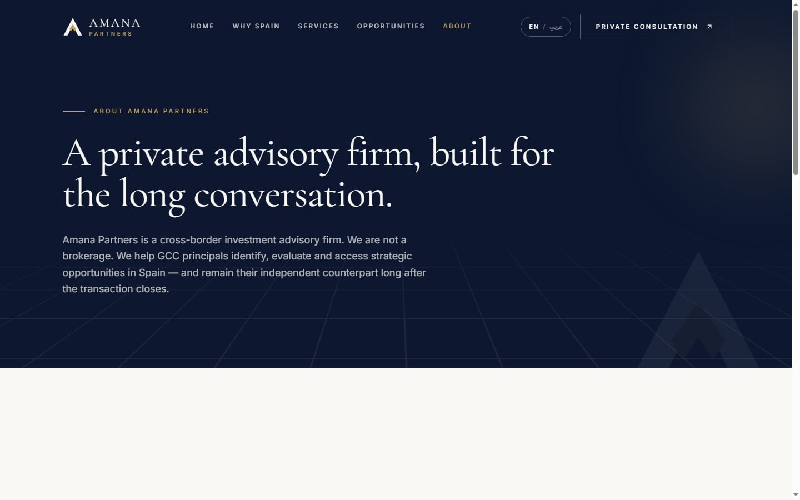

<div align="center">

# Amana Partners

**A private, bilingual marketing site for a cross-border investment advisory firm connecting GCC principals with strategic opportunities in Spain.**

[](https://github.com/Alaa-Younsi/Amana-Partners/actions/workflows/ci.yml)
[](./LICENSE)
[](https://tanstack.com/start)
[](https://tailwindcss.com)

[www.amanapartnersllc.com](https://www.amanapartnersllc.com)

</div>

---

## About

Amana Partners LLC advises GCC principals and family offices on cross-border
investment into Spain — real estate, hospitality, M&A, strategic partnerships
and market entry. This repository is the firm's public site: a fully
bilingual (English / Arabic, RTL-aware) marketing experience built to read as
a private, high-trust advisory practice rather than a template.

The design brief was **quiet confidence**: a warm ivory and navy palette,
Cormorant Garamond serif headlines, restrained gold accents, and motion that
only ever supports the content (scroll reveals, a subtle 3D tilt, a shimmer
on one emphasised word) — never distracts from it. Every interior page opens
on the same dark navy hero with a faint 3D grid horizon, so the six sections
of the site read as one considered system rather than six different pages.

Structurally, the site is server-rendered per request rather than statically
exported: the visitor's language is resolved from a cookie _before_ the first
byte of HTML is sent, so an Arabic visitor never sees an English flash before
the page corrects itself — a common failure mode in bilingual sites that this
one was built specifically to avoid.

Built and designed end-to-end by **[Alaa Younsi](https://alaayounsi.vercel.app/)**.

## Screenshots

<table>
<tr>
<td width="70%"><strong>Desktop</strong> — Home</td>
<td width="30%"><strong>Mobile</strong> — Home</td>
</tr>
<tr>
<td></td>
<td></td>
</tr>
<tr>
<td><strong>Desktop</strong> — Services</td>
<td><strong>Mobile</strong> — Services</td>
</tr>
<tr>
<td></td>
<td></td>
</tr>
<tr>
<td><strong>Desktop</strong> — Contact</td>
<td><strong>Mobile</strong> — Contact</td>
</tr>
<tr>
<td></td>
<td></td>
</tr>
</table>

<details>
<summary>More pages (Why Spain, Opportunities, About)</summary>
<br>



</details>

## Stack

| Layer                     | Choice                                                                                                                  |
| ------------------------- | ----------------------------------------------------------------------------------------------------------------------- |
| Framework                 | [TanStack Start](https://tanstack.com/start) (SSR) on [TanStack Router](https://tanstack.com/router), file-based routes |
| UI                        | React 19, TypeScript (strict mode, no `any`)                                                                            |
| Styling                   | Tailwind CSS v4 — CSS-native `@theme`/`@utility`, no JS config                                                          |
| Runtime / package manager | [Bun](https://bun.sh)                                                                                                   |
| Bundler                   | Vite 8 + Nitro (Vercel preset)                                                                                          |
| Email                     | Nodemailer over the firm's own SMTP, server-only                                                                        |
| Validation                | Zod, shared between the form and the API route                                                                          |
| Images                    | `sharp`, at build time only — no runtime image service                                                                  |
| Icons                     | lucide-react                                                                                                            |
| Hosting                   | Vercel                                                                                                                  |

**Dependencies are deliberately minimal.** There is no component library, no
state manager, no form library, no animation library, and no query cache —
the entire `dependencies` list is nine packages. A hand-rolled component
beats a dependency for a site this size; every dependency here earns its
place.

## Engineering highlights

**Security**

- Content-Security-Policy, HSTS (preload), `X-Frame-Options: DENY`,
  `X-Content-Type-Options: nosniff`, `Cross-Origin-Opener-Policy`, and a
  locked-down Permissions-Policy on every response.
- Trusted Types shipped in report-only mode, ahead of a future move to
  enforcing.
- The contact endpoint is defended in depth: a honeypot field, a minimum
  human-fill-time gate, a same-origin check, an in-memory rate limiter, and
  Zod schema validation — all covered by unit tests
  (`src/lib/contact-guard.test.ts`).
- Secrets never leave `src/server/`; a Vite plugin (`importProtection`) fails
  the build if a client module ever imports server-only code, and a
  build-time bundle check confirms nothing server-side leaks into the shipped
  JS.

**Performance**

- Locale-aware SSR cached at the CDN (`s-maxage`, `stale-while-revalidate`,
  `Vary: Cookie`) — anonymous visitors and crawlers are served from the edge.
- Responsive `<Photo>` images: build-time WebP variants at three widths,
  served via `srcSet`, lazy-loaded except above the fold.
- Only the font weights the design actually uses are requested; Arabic web
  fonts are only fetched when the resolved locale is Arabic.
- Speculation Rules API prerenders same-origin pages the moment a pointer
  settles on a link, paired with router-level intent preloading.

**SEO**

- Per-route canonical, Open Graph and Twitter tags — never duplicated or
  flattened at the root.
- `Organization`, `Person`, `Service`, `ContactPage` and `BreadcrumbList`
  JSON-LD, generated from the same content the page renders.
- A real sitemap with accurate `<lastmod>` pulled from each route's last git
  commit at build time — not a static, silently-stale date.

**Bilingual by construction**

- The `amana-locale` cookie is read in the root route's server loader, so
  the first server-rendered byte already matches the visitor's language —
  no client-side flash from English to Arabic.
- RTL is a first-class layout mode, not a mirrored afterthought: logical
  CSS properties throughout, and typography swaps to Cairo/Tajawal for
  Arabic rather than faking it with the Latin font stack.

## Getting started

```bash
bun install
bun run dev          # build-time assets, then Vite dev server on :8080
```

```bash
bun run build         # build-time assets, then a Nitro build (Vercel preset)
bun run typecheck
bun run lint
bun test               # contact-form guard unit tests
bun run format
```

See [`AGENTS.md`](./AGENTS.md) for the full breakdown of conventions, the
build-time asset pipeline, and what each generated file is for.

## License

**All rights reserved.** This is proprietary, closed-source software built
for Amana Partners LLC. No part of this repository — code, design, or
content — may be copied, reused, or redistributed without written
permission. See [`LICENSE`](./LICENSE).

## Author

**Alaa Younsi** — [alaayounsi.vercel.app](https://alaayounsi.vercel.app/)
